# MIS Sample Database Schema


---

## ⚡ Quick Start Guide (15-30 Minutes)

Get your AI-powered database query system running quickly with these essential steps:

### Fast Track Setup Checklist

1. **✅ Prepare Data Files**
   - Download the 3 CSV files from the Data folder
   - Verify files: `departments.csv`, `employees.csv`, `projects.csv`

2. **✅ Upload to Google Cloud Storage**
   - Create bucket: `mis_sample_data_bucket`
   - Upload all 3 CSV files

3. **✅ Create BigQuery Dataset**
   - Dataset name: `mis_sample_dataset`
   - Load each CSV as a table (auto-detect schema)

4. **✅ Choose Your Implementation**
   - **Recommended:** AgentSpace (conversational AI) - 30 mins
   - **Alternative:** Vertex AI Search (basic search) - 20 mins

5. **✅ Configure AI Agent**
   - Copy the provided system prompt (see Quick Start Prompt below)
   - Connect to BigQuery dataset
   - Enable natural language processing

6. **✅ Test Your Setup**
   - Try: "What is the average salary by department?"
   - Verify results match expected output

### Quick Start System Prompt

```
You are an MIS Database Assistant for the mis_sample_dataset in BigQuery containing:
- departments (6 records): organizational structure
- employees (30 records): personnel and salaries  
- projects (10 records): budgets and assignments

Generate accurate SQL queries from natural language, provide business insights, and maintain data privacy. Format responses professionally with actionable recommendations.
```

**Ready for detailed setup?** Continue to the comprehensive tutorial below.

---

## 🗺️ Implementation Architecture Overview

```mermaid
flowchart TB
    subgraph Data Layer
        CSV[📁 CSV Files<br/>3 tables, 46 records]
        GCS[☁️ Google Cloud Storage<br/>mis_sample_data_bucket]
        BQ[📊 BigQuery<br/>mis_sample_dataset]
    end
    
    subgraph AI Layer
        VS[🔍 Vertex AI Search<br/>Basic Query Interface]
        AS[🤖 AgentSpace<br/>Conversational AI]
    end
    
    subgraph User Interface
        CHAT[💬 Chat Interface]
        API[🔌 API Access]
    end
    
    CSV --> GCS
    GCS --> BQ
    BQ --> VS
    BQ --> AS
    VS --> API
    AS --> CHAT
    CHAT --> USER[👤 Business Users]
    API --> DEV[👨‍💻 Developers]
    
    style CSV fill:#e3f2fd
    style GCS fill:#fff3e0
    style BQ fill:#f3e5f5
    style AS fill:#e8f5e9,stroke:#4caf50,stroke-width:3px
    style CHAT fill:#fffde7
```



## 📋 Which Implementation Should You Choose?

| Method | Best For | Setup Time | Technical Level | Key Features |
|--------|----------|------------|-----------------|--------------|
| **🚀 AgentSpace** (Recommended) | • Production systems<br/>• Conversational queries<br/>• Business users | 30 mins | Medium | • Natural conversation<br/>• Context retention<br/>• Advanced analytics |
| **🔍 Vertex AI Search** | • Simple search needs<br/>• Quick prototypes<br/>• Basic queries | 20 mins | Low | • Search interface<br/>• Quick setup<br/>• Limited customization |
| **📊 Direct BigQuery** | • Technical users<br/>• Custom applications<br/>• SQL experts | 15 mins | High | • Full SQL control<br/>• No AI features<br/>• Maximum flexibility |

---

## Database Overview

**Database Name:** `mis_sample_db`  
**GCS Bucket:** `mis_sample_data_bucket`

This is a sample relational database designed for Management Information Systems (MIS) course demonstrations and learning SQL queries in Vertex AI. The database contains realistic business data with departments, employees, and project management information to illustrate key MIS concepts.

**Purpose:**
- MIS course demonstrations and exercises
- SQL query practice and experimentation
- Business intelligence and reporting concepts
- Vertex AI database connectivity testing
- Relational database and data modeling education
- Management decision-making scenario analysis

## Entity Relationship Diagram


## Table Schemas

### 1. departments.csv

| Column | Data Type | Constraints | Description |
|--------|-----------|-------------|-------------|
| department_id | INTEGER | PRIMARY KEY | Unique department identifier |
| department_name | VARCHAR(50) | NOT NULL | Department name |
| manager | VARCHAR(100) | NOT NULL | Department manager name |

**Row Count:** 6 departments
**Sample Data Preview:**
```
department_id,department_name,manager
1,Engineering,Sarah Chen
2,Product Management,Michael Rodriguez
3,Marketing,Amanda Thompson
```

### 2. employees.csv

| Column | Data Type | Constraints | Description |
|--------|-----------|-------------|-------------|
| employee_id | INTEGER | PRIMARY KEY | Unique employee identifier |
| first_name | VARCHAR(50) | NOT NULL | Employee first name |
| last_name | VARCHAR(50) | NOT NULL | Employee last name |
| salary | INTEGER | NOT NULL | Annual salary in USD |
| hire_date | DATE | NOT NULL | Date of employment start |
| department_id | INTEGER | FOREIGN KEY | References departments.department_id |

**Row Count:** 30 employees
**Salary Range:** $72,000 - $155,000
**Sample Data Preview:**
```
employee_id,first_name,last_name,salary,hire_date,department_id
101,Sarah,Chen,145000,2019-03-15,1
102,Alex,Patel,125000,2020-07-22,1
103,Maria,Gonzalez,135000,2021-01-10,1
```

### 3. projects.csv

| Column | Data Type | Constraints | Description |
|--------|-----------|-------------|-------------|
| project_id | INTEGER | PRIMARY KEY | Unique project identifier |
| project_name | VARCHAR(100) | NOT NULL | Project name |
| start_date | DATE | NOT NULL | Project start date |
| end_date | DATE | NOT NULL | Project end date |
| budget | INTEGER | NOT NULL | Project budget in USD |
| assigned_employee_id | INTEGER | FOREIGN KEY | References employees.employee_id |

**Row Count:** 10 projects
**Budget Range:** $275,000 - $1,500,000
**Sample Data Preview:**
```
project_id,project_name,start_date,end_date,budget,assigned_employee_id
501,Phoenix Mobile App,2023-01-15,2024-02-28,850000,103
502,Atlas Cloud Migration,2022-09-01,2024-03-31,1200000,101
503,Quantum Analytics Platform,2023-06-01,2024-08-30,1500000,102
```

## Relationships

### Department to Employees (1:N)
- One department can have multiple employees
- Each employee belongs to exactly one department
- **Foreign Key:** `employees.department_id` → `departments.department_id`

### Employee to Projects (1:N)
- One employee can lead multiple projects
- Each project is assigned to exactly one employee leader
- **Foreign Key:** `projects.assigned_employee_id` → `employees.employee_id`

## Sample Queries

### Basic Queries

**List all departments:**
```sql
SELECT * FROM departments;
```

**Find employees in Engineering:**
```sql
SELECT * FROM employees WHERE department_id = 1;
```

**Show active projects (end date in future):**
```sql
SELECT * FROM projects WHERE end_date > CURRENT_DATE;
```

### JOIN Queries

**Employees with their department names:**
```sql
SELECT e.first_name, e.last_name, d.department_name 
FROM employees e 
JOIN departments d ON e.department_id = d.department_id;
```

**Projects with assigned employee details:**
```sql
SELECT p.project_name, e.first_name, e.last_name, p.budget
FROM projects p
JOIN employees e ON p.assigned_employee_id = e.employee_id;
```

**Complete project overview:**
```sql
SELECT p.project_name, e.first_name, e.last_name, d.department_name, p.budget
FROM projects p
JOIN employees e ON p.assigned_employee_id = e.employee_id
JOIN departments d ON e.department_id = d.department_id;
```

### Aggregation Queries

**Average salary by department:**
```sql
SELECT d.department_name, AVG(e.salary) as avg_salary
FROM employees e
JOIN departments d ON e.department_id = d.department_id
GROUP BY d.department_name;
```

**Total budget by department:**
```sql
SELECT d.department_name, SUM(p.budget) as total_budget
FROM projects p
JOIN employees e ON p.assigned_employee_id = e.employee_id
JOIN departments d ON e.department_id = d.department_id
GROUP BY d.department_name;
```

**Employee count per department:**
```sql
SELECT d.department_name, COUNT(e.employee_id) as employee_count
FROM departments d
LEFT JOIN employees e ON d.department_id = e.department_id
GROUP BY d.department_name;
```

## Data Statistics

- **Total Employees:** 30
- **Total Departments:** 6  
- **Total Projects:** 10
- **Date Range:** 2018-2024
- **Total Project Budget:** $7,145,000
- **Average Employee Salary:** $103,500

## Cloud Storage Setup

**GCS Bucket:** `mis_sample_data_bucket`

To use this database with Vertex AI:
1. Upload all three CSV files to the `mis_sample_data_bucket` in Google Cloud Storage
2. Load data into BigQuery using the `mis_sample_db` dataset
3. Configure Vertex AI Search to connect to the BigQuery dataset for text-to-SQL capabilities

## MIS Learning Objectives

This database supports key MIS concepts:
- **Data Management:** Understanding relational database design and normalization
- **Business Intelligence:** Creating reports and dashboards from operational data
- **Decision Support:** Using data analysis to support management decisions
- **Information Systems Integration:** Connecting databases with AI/ML tools like Vertex AI
- **Data Modeling:** Understanding entity relationships and business processes

## Usage Notes

This database is ideal for:
- MIS course demonstrations and assignments
- Learning SQL JOIN operations and complex queries
- Practicing aggregate functions and business reporting
- Understanding foreign key relationships and data integrity
- Testing data visualization and BI tools
- Experimenting with Vertex AI database connectors and text-to-SQL

All data is fictional and designed for educational and experimental purposes in MIS coursework.

---

# Complete Setup Tutorial: Vertex AI Search with BigQuery Integration

## Tutorial Overview

This comprehensive tutorial is structured for different use cases and skill levels:

**📚 Basic Setup (Educational Focus)** - Ideal for MIS students and course demonstrations
- Essential concepts and step-by-step implementation
- Academic learning objectives and discussion points
- Suitable for classroom environments and individual learning

**🏢 Advanced Enterprise Configuration** - Designed for production deployments
- Advanced features and enterprise-grade security
- Performance optimization and scalability considerations
- Production-ready implementation with comprehensive testing

---

## 📚 Basic Setup: Educational Implementation

This section provides a step-by-step tutorial for setting up the MIS Sample Database with Vertex AI Search capabilities, perfect for educational environments and MIS course demonstrations.

## Prerequisites

Before starting this tutorial, ensure you have:
- A Google Cloud Platform account with billing enabled
- Access to the following GCP services:
  - Google Cloud Storage
  - BigQuery
  - Vertex AI
- Project permissions for creating resources and enabling APIs
- The three CSV files from this database ready for upload

## Step 1: Initial Setup and API Configuration

### 1.1 Access Vertex AI Studio
Navigate to the Google Cloud Console and access Vertex AI Studio. You'll be prompted to enable required APIs.


**Key Actions:**
- Enable Vertex AI API when prompted
- Review and accept terms of service for API usage
- Note that Cloud Storage API should already be enabled

### 1.2 Navigate to Cloud Products
Access the full range of Google Cloud services from the navigation menu to locate BigQuery and Cloud Storage.


**Key UI Elements:**
- Cloud Hub for accessing all services
- Pinned products section for frequently used services
- Product categories for easy navigation

## Step 2: Cloud Storage Setup

### 2.1 Create Storage Bucket
Create a new Google Cloud Storage bucket named `mis_sample_data_bucket` to store your CSV files.


**Configuration Steps:**
- Choose appropriate region for your project
- Set public access prevention
- Configure lifecycle management if needed
- Upload all three CSV files (departments.csv, employees.csv, projects.csv)

## Step 3: BigQuery Dataset and Table Creation

### 3.1 Access BigQuery Console
Navigate to BigQuery to create your dataset and load data from Cloud Storage.


**Important Configuration:**
- Create dataset named `mis_sample_dataset`
- Ensure dataset location matches your storage bucket region
- Set appropriate access controls for your project

### 3.2 Create Tables from CSV Files
Load each CSV file into separate BigQuery tables within your dataset.


**Table Creation Settings:**
- Source: Google Cloud Storage
- File format: CSV
- Table naming: departments, employees, projects
- Schema: Auto-detect from CSV headers
- Write preference: Write if empty

### 3.3 Verify Table Structure
Confirm all three tables are created successfully with proper schema detection.


**Validation Checklist:**
- All three tables visible in dataset
- Correct row counts for each table
- Schema properly detected from CSV headers
- Primary and foreign key relationships maintained

## Step 4: Vertex AI Search Configuration

### 4.1 Access Vertex AI Search
Navigate to Vertex AI Search & Conversation to begin creating your intelligent search agent.


**Navigation Path:**
- Vertex AI → Search & Conversation
- Ensure you're in the correct project
- Verify API access and permissions

### 4.2 Create Search Application
Initialize a new search application specifically for database querying.


**Application Configuration:**
- App type: Search
- Name: MIS Sample Database Search
- Enable agent capabilities for text-to-SQL
- Configure for business intelligence use case

### 4.3 Configure Data Store
Set up the data store to connect to your BigQuery dataset.


**Critical Settings:**
- Data source: BigQuery
- Select entire dataset (not individual tables)
- Enable structured data parsing
- Configure query permissions

### 4.4 BigQuery Integration
Connect your search application to the BigQuery dataset containing your tables.


**Integration Steps:**
- Select project and dataset (`mis_sample_dataset`)
- Grant necessary permissions for data access
- Enable text-to-SQL functionality
- Configure query complexity limits

### 4.5 Data Store Creation
Complete the data store setup with proper naming and configuration.


**Final Configuration:**
- Data store name: `mis_sample_datastore`
- Enable advanced query features
- Set up indexing for optimal performance
- Configure security and access controls

### 4.6 Indexing Process
Wait for the system to index your database schema and relationships.


**Indexing Features:**
- Schema analysis and relationship mapping
- Query optimization preparation
- Text-to-SQL model training on your data structure
- Performance optimization for common query patterns

## Step 5: Testing and Validation

### 5.1 Preview Interface
Access the preview interface to test your search capabilities.


**Testing Environment:**
- Interactive query interface
- Real-time SQL generation
- Result validation and formatting
- Query performance monitoring

### 5.2 Sample Query Testing
Test complex queries that require joins across multiple tables.


**Test Query Examples:**
- "What projects are employees in the Engineering department working on?"
- "Show me the total budget by department"
- "List employees earning more than $100,000 and their projects"

### 5.3 Final Verification
Verify that your complete setup is working correctly with the final dataset view.


**Success Indicators:**
- All tables visible and accessible
- Complex queries executing successfully
- Proper SQL generation from natural language
- Expected results returned accurately

## Business Intelligence Query Examples

Once your setup is complete, try these MIS-focused queries:

### Management Decision Support Queries
```
"What is the average salary by department and how does it compare to project budgets?"
"Which department managers oversee the highest value projects?"
"Show me employee productivity based on project completion and salary investment"
```

### Operational Analysis Queries
```
"How many employees were hired each year and in which departments?"
"What is the project success rate by department over time?"
"Identify departments with budget overruns or underutilization"
```

### Strategic Planning Queries
```
"What are the projected resource needs based on current project timelines?"
"Which departments should receive additional staffing based on project load?"
"How do salary investments correlate with project value delivery?"
```


## MIS Course Discussion Points

### Data Management Concepts
- How does this setup demonstrate database normalization principles?
- What are the advantages of using cloud-based data storage?
- How do foreign key relationships support data integrity?

### Business Intelligence Applications
- How can natural language querying improve manager productivity?
- What types of business decisions can be supported by this data?
- How does real-time query capability impact decision-making speed?

### Information Systems Integration
- What are the benefits of integrating AI with traditional databases?
- How does this architecture support scalability and performance?
- What security considerations are important in cloud-based systems?

## 📚 Learning Path for MIS Students

### Week 1: Foundation
- [ ] Complete Quick Start Guide
- [ ] Run 5 basic queries successfully
- [ ] Understand database relationships

### Week 2: Advanced Queries
- [ ] Practice JOIN operations
- [ ] Create aggregate reports
- [ ] Test edge cases

### Week 3: Business Applications
- [ ] Build executive dashboard mockup
- [ ] Analyze department efficiency
- [ ] Generate predictive insights

### Week 4: Professional Skills
- [ ] Document your implementation
- [ ] Present findings to class
- [ ] Propose system improvements

---

## 🏢 Advanced Enterprise Configuration

This section covers advanced setup and configuration options for production-ready Vertex AI Search implementations, including enterprise features, advanced testing, and optimization strategies.

> **Note:** This advanced section builds upon the basic setup. Ensure you have completed the fundamental configuration steps before proceeding with enterprise features.

## Step 6: Advanced App Configuration and Testing

### 6.1 Search App Interface Navigation
Access the complete Vertex AI Search interface to configure advanced features and enterprise settings.


**Advanced Features Available:**
- Multi-modal search capabilities
- Enterprise security configurations
- Advanced analytics and monitoring
- Custom response formatting
- Production deployment options

### 6.2 Data Store Management Console
Navigate to the comprehensive data store management interface for advanced configuration.


**Management Capabilities:**
- Data source monitoring and health checks
- Indexing status and performance metrics
- Security and access control configuration
- Schema validation and optimization
- Multi-dataset integration options

### 6.3 Application Development Workflow
Access the application development environment for creating sophisticated search applications.


**Development Features:**
- Application template selection
- Custom UI component integration
- API endpoint configuration
- Testing and debugging tools
- Performance optimization settings

### 6.4 Data Store Configuration Details
Configure advanced data store settings for enterprise-grade performance and reliability.


**Enterprise Configuration Options:**
- Data residency and compliance settings
- Advanced security and encryption
- Custom indexing strategies
- Performance tuning parameters
- Backup and disaster recovery options

### 6.5 Search App Creation Workflow
Complete the advanced search application creation process with enterprise features.


**Advanced App Features:**
- Generative AI response capabilities
- Custom prompt engineering
- Multi-language support
- Advanced filtering and faceting
- Enterprise authentication integration

### 6.6 Application Architecture Overview
Understand the complete application architecture and component services.


**Architecture Components:**
- **Prepare Stage:** Data ingestion and preprocessing
- **Retrieve Stage:** Intelligent search and retrieval
- **Signal Stage:** Relevance scoring and ranking
- **Serve Stage:** Response generation and formatting

### 6.7 Production Deployment Interface
Access production-ready deployment options and enterprise management tools.


**Production Features:**
- Scalable infrastructure management
- Load balancing and auto-scaling
- Monitoring and alerting systems
- Performance analytics dashboards
- Enterprise support and SLA options

### 6.8 Advanced Testing Environment
Utilize comprehensive testing tools for validating complex business queries.


**Testing Capabilities:**
- Natural language query validation
- SQL generation accuracy testing
- Performance benchmarking
- Multi-user concurrent testing
- Edge case scenario validation

### 6.9 Query Response Optimization
Configure advanced response generation and optimization settings.


**Optimization Features:**
- Response format customization
- Latency optimization
- Content filtering and safety
- Custom business logic integration
- Multi-modal response generation

### 6.10 Enterprise Integration Testing
Test enterprise integration capabilities and API connectivity.


**Integration Testing:**
- API endpoint validation
- Authentication and authorization testing
- Data pipeline verification
- Third-party system connectivity
- Performance under load testing

### 6.11 Application Management Dashboard
Monitor and manage deployed applications through comprehensive dashboards.


**Dashboard Features:**
- Real-time usage analytics
- Performance monitoring
- Error tracking and debugging
- User behavior insights
- Cost optimization recommendations

### 6.12 Final Production Validation
Complete final validation of the production-ready search application.


**Validation Checklist:**
- End-to-end functionality testing
- Security and compliance verification
- Performance benchmark confirmation
- User acceptance testing completion
- Production readiness assessment

## Enterprise Query Examples for Advanced Testing

### Complex Business Intelligence Queries
```
"Analyze the correlation between department budget allocations and employee satisfaction scores over the past 3 years"
"Predict which departments will exceed their project budgets based on current spending patterns"
"Generate a comprehensive workforce planning report including skills gap analysis"
```

### Multi-Table Analytical Queries
```
"Create a dashboard showing project ROI by department manager with trend analysis"
"Identify high-performing employees for promotion based on project success rates and peer feedback"
"Generate executive summary of organizational efficiency metrics across all business units"
```

### Strategic Planning Queries
```
"What scenarios should we consider for next fiscal year's resource allocation based on current project trajectories?"
"How do our compensation structures compare to industry benchmarks for similar roles and performance levels?"
"Generate recommendations for organizational restructuring to optimize project delivery timelines"
```

---

---

# 🤖 AI Agent System Prompts and Configuration

This section provides comprehensive system prompt templates and configuration guidelines for creating effective AI agents for business intelligence and database querying applications.

## Quick Start: Essential System Prompt

For immediate implementation, use this production-ready system prompt for your MIS Database AI Agent:

### **MIS Database AI Agent - Complete System Prompt**

```
You are an expert Business Intelligence AI Agent specializing in Management Information Systems database analysis for the MIS Sample Database. Your role is to help users extract meaningful insights from organizational data through natural language queries.

**Database Schema Context:**
You have access to three interconnected tables:
- departments (6 records): department_id, department_name, manager
- employees (30 records): employee_id, first_name, last_name, salary, hire_date, department_id
- projects (10 records): project_id, project_name, start_date, end_date, budget, assigned_employee_id

**Core Capabilities:**
- Generate accurate SQL queries from natural language requests
- Provide comprehensive business intelligence analysis with context
- Explain query results in business terms with actionable insights
- Suggest follow-up questions and additional analysis opportunities
- Maintain data privacy and security protocols

**Response Format Standards:**
- Lead with an executive summary for complex analyses
- Present numerical results with appropriate context (percentages, trends, comparisons)
- Use professional language suitable for management audiences
- Include specific recommendations when applicable
- Always validate results for accuracy and business logic

**Query Generation Guidelines:**
- Use proper table aliases and JOIN syntax
- Include relevant WHERE clauses for filtering
- Apply appropriate aggregate functions (SUM, AVG, COUNT)
- Consider date ranges and time-based analysis
- Ensure results are sorted meaningfully

**Business Intelligence Focus:**
Prioritize insights that support strategic decision-making, resource optimization, performance improvement, and operational efficiency. When uncertain about query intent, ask clarifying questions to ensure accurate analysis.

**Data Privacy:** Aggregate individual employee data appropriately and flag any queries that might violate data governance policies.
```

## Advanced System Prompt Templates

This section provides comprehensive system prompt templates and configuration guidelines for creating effective AI agents for business intelligence and database querying applications.

## Enterprise System Prompt Templates

### 1. MIS Database Query Agent - Primary System Prompt

```
You are an expert Business Intelligence AI Agent specializing in Management Information Systems database analysis. Your role is to help users extract meaningful insights from organizational data through natural language queries.

**Core Capabilities:**
- Generate accurate SQL queries from natural language requests
- Provide comprehensive business intelligence analysis
- Explain query results in business context
- Suggest follow-up questions and additional analysis
- Maintain data privacy and security protocols

**Response Guidelines:**
- Always validate query results for accuracy and completeness
- Provide context for numerical results (trends, comparisons, benchmarks)
- Use clear, professional language appropriate for management audiences
- Include relevant visualizations or formatting suggestions when applicable
- Highlight any assumptions or limitations in your analysis

**Database Context:**
You have access to a sample organizational database containing:
- departments: organizational structure and management
- employees: personnel information including salaries, hire dates, and assignments  
- projects: project details, budgets, timelines, and assigned personnel

**Security Guidelines:**
- Never expose sensitive personal information unnecessarily
- Aggregate data when possible to protect individual privacy
- Flag any queries that might violate data governance policies
- Recommend appropriate access controls for sensitive analyses

**Business Focus:**
Prioritize insights that support:
- Strategic decision-making
- Resource optimization
- Performance improvement
- Risk management
- Operational efficiency

When uncertain about query intent, ask clarifying questions to ensure accurate analysis.
```

### 2. Financial Analysis Specialist - System Prompt

```
As a Financial Analysis Expert specializing in organizational budget and resource management, you excel at:

**Primary Functions:**
- Budget analysis and variance reporting
- ROI calculations and project financial assessment
- Cost optimization recommendations
- Financial trend identification and forecasting
- Compensation analysis and benchmarking

**Response Standards:**
- Provide precise numerical calculations with appropriate rounding
- Include percentage changes and variance analysis
- Explain financial implications in business terms
- Suggest actionable recommendations based on findings
- Maintain accuracy in all financial computations

**Formatting Requirements:**
- Use currency formatting for monetary values
- Present percentages with appropriate precision
- Create clear tables for comparative analysis
- Include executive summary for complex analyses

**Business Context Awareness:**
Consider organizational goals, industry benchmarks, and economic factors in your analysis and recommendations.
```

### 3. Human Resources Analytics Agent - System Prompt

```
You are an HR Analytics Specialist focused on workforce intelligence and organizational development. Your expertise includes:

**Analytical Areas:**
- Employee performance and productivity metrics
- Workforce planning and capacity analysis  
- Talent acquisition and retention strategies
- Compensation equity and market analysis
- Skills gap assessment and training needs

**Response Approach:**
- Maintain strict confidentiality for individual employee data
- Focus on aggregate trends and patterns
- Provide actionable insights for HR strategy
- Include statistical significance when relevant
- Suggest policy improvements based on data insights

**Ethical Considerations:**
- Ensure fair and unbiased analysis
- Protect employee privacy in all recommendations
- Consider legal compliance in HR-related insights
- Promote diversity, equity, and inclusion perspectives

Present findings in formats suitable for HR leadership and executive review.
```

### 4. Operations Management Advisor - System Prompt

```
As an Operations Management Advisor, you specialize in:

**Core Competencies:**
- Project management efficiency analysis
- Resource allocation optimization
- Timeline and milestone tracking
- Cross-functional collaboration assessment
- Process improvement identification

**Analytical Framework:**
- Apply lean management principles
- Focus on measurable efficiency gains
- Identify bottlenecks and optimization opportunities
- Recommend process standardization where beneficial
- Consider scalability in all recommendations

**Communication Style:**
- Present findings with clear action items
- Use project management terminology appropriately  
- Provide both tactical and strategic recommendations
- Include implementation timelines and resource requirements

Focus on operational excellence and continuous improvement opportunities.
```

## Advanced Prompt Engineering Guidelines

### System Instruction Best Practices for 2025

Based on Google's latest Vertex AI documentation, implement these advanced prompt engineering strategies:

**1. Multi-Turn Conversation Management**
```
Maintain context across conversation turns by:
- Referencing previous queries and results
- Building on established analysis threads
- Offering logical follow-up suggestions
- Maintaining consistent terminology and metrics
```

**2. Response Format Optimization**
```
Structure responses using:
- Executive summary for complex analyses
- Detailed findings with supporting data
- Visual formatting suggestions (tables, charts)
- Action items and recommendations
- Confidence levels for predictions
```

**3. Error Handling and Validation**
```
When encountering issues:
- Clearly explain any limitations or uncertainties
- Suggest alternative approaches or queries
- Validate data consistency before presenting results
- Flag potential data quality issues
```

### Industry-Specific Customization Templates

**For Healthcare Organizations:**
```
Additional context: Healthcare compliance requirements (HIPAA), patient privacy protection, clinical outcome metrics, regulatory reporting needs.
```

**For Financial Services:**
```
Additional context: Regulatory compliance (SOX, Basel III), risk management frameworks, audit trail requirements, financial reporting standards.
```

**For Manufacturing:**
```
Additional context: Supply chain optimization, quality control metrics, production efficiency, safety compliance, lean manufacturing principles.
```

**For Technology Companies:**
```
Additional context: Agile development metrics, innovation tracking, talent retention in competitive markets, intellectual property considerations.
```

## Implementation Configuration

### Vertex AI Search Configuration Parameters

**Response Generation Settings:**
```json
{
  "temperature": 0.2,
  "topK": 40,
  "topP": 0.8,
  "maxOutputTokens": 2048,
  "safetySettings": [
    {
      "category": "HARM_CATEGORY_HARASSMENT",
      "threshold": "BLOCK_MEDIUM_AND_ABOVE"
    },
    {
      "category": "HARM_CATEGORY_HATE_SPEECH", 
      "threshold": "BLOCK_MEDIUM_AND_ABOVE"
    }
  ]
}
```

**Query Processing Configuration:**
```json
{
  "searchConfig": {
    "extractiveContentSpec": {
      "maxExtractiveAnswerCount": 5,
      "maxExtractiveSegmentCount": 10
    },
    "facetSpecs": [
      {
        "facetKey": {
          "key": "department_name"
        }
      },
      {
        "facetKey": {
          "key": "salary_range"
        }
      }
    ]
  }
}
```

### Performance Optimization Settings

**For High-Volume Queries:**
- Implement query caching for common business intelligence requests
- Use batch processing for large analytical workloads
- Enable auto-scaling for peak usage periods
- Configure monitoring and alerting for performance degradation

**For Real-Time Analytics:**
- Optimize for low latency responses
- Implement streaming data updates where applicable
- Use appropriate indexing strategies for frequently queried fields
- Balance freshness requirements with performance needs

## Testing and Validation Framework

### System Prompt Testing Methodology

**1. Functionality Testing**
Test each prompt template with:
- Basic query variations
- Complex multi-table joins
- Edge cases and error conditions
- Different user persona scenarios

**2. Accuracy Validation**
Verify that responses:
- Generate correct SQL queries
- Provide accurate calculations
- Include appropriate business context
- Follow security and privacy guidelines

**3. Performance Benchmarking**
Measure:
- Response time for different query complexities
- Resource utilization under load
- Accuracy rates across different query types
- User satisfaction metrics

### Continuous Improvement Process

**Monthly Review Cycle:**
1. Analyze query patterns and success rates
2. Update system prompts based on user feedback
3. Refine response formats for better usability
4. Test new features and capabilities
5. Update documentation and training materials

**Quality Assurance Checklist:**
- [ ] System prompts align with business objectives
- [ ] Responses maintain appropriate professional tone
- [ ] Data privacy and security protocols are followed
- [ ] Query accuracy meets established benchmarks
- [ ] User experience is intuitive and efficient
- [ ] Documentation is current and comprehensive

This comprehensive system prompt framework ensures your Vertex AI Search agents deliver consistent, accurate, and valuable business intelligence insights while maintaining enterprise-grade security and performance standards.

---

# 🚀 AgentSpace Implementation (Recommended Approach)

## Setup Process Overview

```mermaid
flowchart LR
    A[📝 Prepare<br/>CSV Data] --> B[☁️ Upload<br/>to GCS]
    B --> C[📊 Create<br/>BigQuery Dataset]
    C --> D[🤖 Configure<br/>AgentSpace]
    D --> E[🧪 Test<br/>Queries]
    E --> F[🚀 Deploy<br/>to Production]
    
    style A fill:#e3f2fd
    style D fill:#e8f5e9,stroke:#4caf50,stroke-width:2px
    style F fill:#fff9c4
```



## Complete AgentSpace Setup Tutorial

### Step 1: Initialize AgentSpace Configuration

Begin by accessing the AgentSpace interface, which provides a more comprehensive agent creation experience than traditional search configurations.


**Key Configuration Elements:**
- Agent naming and identification
- Purpose definition for business intelligence
- Tool selection and integration options
- Advanced configuration settings access

### Step 2: Create Your AI Agent

Navigate to the agent creation workflow where you'll define the core characteristics of your business intelligence assistant.


**Agent Configuration Steps:**
1. **Agent Name:** `MIS-Database-Assistant` or similar descriptive name
2. **Agent Type:** Conversational agent with data analysis capabilities
3. **Primary Function:** Business intelligence and database querying
4. **Language Model:** Select appropriate model (e.g., Gemini Pro for balanced performance)
5. **Response Style:** Professional, analytical, and business-focused

### Step 3: Configure Data Store Connection

Connect your BigQuery dataset to the AgentSpace, enabling the AI agent to access and query your database tables.


**BigQuery Integration Settings:**
- **Project ID:** Your Google Cloud project
- **Dataset:** `mis_sample_dataset` 
- **Tables:** Enable access to all three tables (departments, employees, projects)
- **Permissions:** Read access with query execution capabilities
- **Schema Recognition:** Automatic relationship detection enabled

### Step 4: Advanced Tool Integration

Configure additional tools and capabilities for your agent to enhance its analytical abilities.


**Available Tools Configuration:**
- **SQL Query Executor:** For direct database queries
- **Data Analyzer:** For statistical analysis and aggregations
- **Report Generator:** For formatted business reports
- **Visualization Suggester:** For recommending appropriate charts/graphs
- **Natural Language Processor:** For understanding complex business queries

### Step 5: Customize Agent Instructions

Define comprehensive system instructions that govern your agent's behavior and response patterns.


**System Instructions for AgentSpace:**

```
You are an expert MIS Database Assistant specializing in business intelligence analysis using the MIS Sample Database hosted in BigQuery.

**Your Role:**
- Serve as a conversational business intelligence analyst
- Transform natural language queries into actionable insights
- Provide comprehensive analysis with business context
- Maintain professional communication throughout interactions

**Database Context:**
You have access to the mis_sample_dataset containing:
- departments table: Organizational structure and management
- employees table: Personnel records with compensation and tenure
- projects table: Project portfolio with budgets and assignments

**Interaction Guidelines:**
- Begin responses with a brief acknowledgment of the query
- Provide step-by-step explanation of your analysis approach
- Present results in clear, formatted structures
- Offer follow-up questions to deepen analysis
- Conclude with actionable recommendations when appropriate

**Technical Capabilities:**
- Execute complex SQL queries with joins and aggregations
- Perform trend analysis and pattern recognition
- Calculate business metrics and KPIs
- Generate comparative analyses across departments/time periods

**Professional Standards:**
- Maintain confidentiality of individual employee data
- Provide accuracy disclaimers for predictive insights
- Cite specific data points to support conclusions
- Format responses for executive readability
```

### Step 6: Test Your AgentSpace Implementation

Access the interactive chat interface to validate your agent's capabilities with real queries.


**Testing Methodology:**
1. Start with simple queries to verify basic functionality
2. Progress to complex multi-table joins
3. Test edge cases and error handling
4. Validate response accuracy and formatting
5. Ensure appropriate business context in responses

### Step 7: Live Query Validation

Conduct comprehensive testing with actual business intelligence queries to ensure production readiness.

## Query Processing Flow


**Sample Query Testing:**
- **Query:** "What is the average salary by department and how does it compare to project budgets?"
- **Expected Response:** Detailed analysis with salary averages per department, total project budgets by department, and comparative insights
- **Validation Points:** Correct calculations, proper joins, business interpretation


**Response Quality Checklist:**
- ✅ Accurate SQL generation
- ✅ Correct data aggregation
- ✅ Professional formatting
- ✅ Business context provided
- ✅ Follow-up suggestions offered
- ✅ Actionable insights included

## AgentSpace Production Deployment

### Deployment Considerations

**Performance Optimization:**
- Configure caching for frequently requested queries
- Set appropriate timeout limits for complex analyses
- Enable auto-scaling for high-demand periods
- Monitor token usage and optimize prompt efficiency

**Security Configuration:**
- Implement role-based access control (RBAC)
- Enable audit logging for all queries
- Configure data masking for sensitive information
- Set up monitoring alerts for unusual query patterns

**Integration Options:**
- REST API endpoints for programmatic access
- SDK integration for custom applications
- Webhook support for event-driven architectures
- Direct embedding in business applications

### Best Practices for AgentSpace

**1. Iterative Refinement:**
- Continuously update system instructions based on usage patterns
- Refine response formats based on user feedback
- Expand tool capabilities as needs evolve
- Regular testing with new query scenarios

**2. Monitoring and Analytics:**
- Track query success rates and response times
- Analyze user interaction patterns
- Monitor for potential security issues
- Generate usage reports for stakeholders

**3. Maintenance Schedule:**
- Weekly review of query logs for optimization opportunities
- Monthly updates to system instructions
- Quarterly security audits
- Annual comprehensive system review

## Comparison: Migration Path from Vertex AI Search

### Migration Benefits

**Enhanced User Experience:**
- Natural conversation flow vs. search-style queries
- Contextual understanding across multiple queries
- More intuitive error handling and clarification requests

**Improved Analytics Capabilities:**
- Deeper analytical insights with explanations
- Proactive suggestion of related analyses
- Better handling of ambiguous queries

**Enterprise Features:**
- Advanced security and compliance options
- Better integration with existing enterprise systems
- More comprehensive monitoring and logging

### Migration Steps

1. **Export existing configurations** from Vertex AI Search
2. **Create new AgentSpace instance** with enhanced features
3. **Import and adapt system prompts** for conversational format
4. **Test thoroughly** with existing query patterns
5. **Gradual rollout** with parallel systems if needed
6. **Full migration** once confidence established

## AgentSpace Query Examples

### Advanced Business Intelligence Queries

```
User: "Analyze our organizational efficiency by comparing department sizes, average salaries, and project allocation. Include recommendations for resource optimization."

AgentSpace: "I'll analyze organizational efficiency across multiple dimensions. Let me examine department structures, compensation, and project distribution...

[Detailed analysis with SQL queries, calculations, and visual recommendations]

Key findings:
1. Engineering department has highest salary average ($115,000) but manages 40% of total project budget
2. Marketing shows optimal staff-to-project ratio at 1:1.5
3. Sales department appears understaffed relative to project load

Recommendations:
- Consider redistributing projects from Engineering to balance workload
- Increase Sales headcount by 2-3 employees to improve project delivery
- Review Marketing's successful model for potential application elsewhere"
```

### Predictive Analysis Queries

```
User: "Based on current trends, what departments will likely need additional resources in the next quarter?"

AgentSpace: "I'll analyze current resource utilization and project timelines to predict future needs...

[Comprehensive trend analysis with projections]

Predicted resource needs for Q2:
- Engineering: 2 additional senior developers (based on 3 projects entering critical phase)
- Product Management: 1 additional PM (new project initiations)
- Sales: Temporary contractor support (seasonal campaign period)"
```


## Future Enhancements and Roadmap

### Upcoming AgentSpace Features (2025-2026)

- **Multi-modal Analysis:** Integration with visual data and documents
- **Advanced ML Models:** Predictive analytics and forecasting capabilities
- **Real-time Collaboration:** Multiple users interacting with same agent
- **Custom Tool Development:** Create organization-specific analysis tools
- **Enhanced Visualization:** Automatic chart and dashboard generation

### Continuous Improvement Strategy

1. **User Feedback Loop:** Regular surveys and interaction analysis
2. **Performance Metrics:** Track and optimize key performance indicators
3. **Feature Adoption:** Monitor usage of advanced capabilities
4. **Training Updates:** Regular model updates with new business scenarios
5. **Security Enhancements:** Continuous security posture improvements

This AgentSpace implementation provides a more sophisticated, conversational, and powerful approach to business intelligence compared to traditional search interfaces, making it the recommended solution for modern MIS deployments.

---

# 🔧 Unified Troubleshooting Guide

## Common Issues & Solutions Matrix

| Issue Category | Symptoms | Quick Fix | Prevention |
|---------------|----------|-----------|------------|
| **🔐 Permissions** | "Access denied" errors | Check IAM roles: BigQuery Data Viewer, Vertex AI User | Use service accounts with minimal required permissions |
| **📊 Data Loading** | Schema detection fails | Verify CSV headers, check for special characters | Test with sample data first |
| **🐌 Performance** | Slow query responses (>5 sec) | • Simplify system prompts<br/>• Enable caching<br/>• Check table indexes | Monitor query patterns, optimize frequently used queries |
| **🔗 Connectivity** | Agent can't access BigQuery | Verify dataset permissions and service account | Test connection before full deployment |
| **❓ Query Accuracy** | Incorrect SQL generation | Refine system instructions with examples | Include sample queries in prompts |
| **💬 Context Issues** | Agent misunderstands intent | Add business terminology to prompt | Provide clear database schema context |

## Step-by-Step Troubleshooting Process

```mermaid
flowchart TD
    START[Issue Detected] --> TYPE{Issue Type?}
    TYPE -->|Permission| PERM[Check IAM Roles]
    TYPE -->|Data| DATA[Verify CSV Format]
    TYPE -->|Performance| PERF[Check Query Complexity]
    TYPE -->|Connection| CONN[Test Service Account]
    
    PERM --> FIX1[Add Required Roles]
    DATA --> FIX2[Clean Data & Reload]
    PERF --> FIX3[Optimize Prompts/Indexes]
    CONN --> FIX4[Update Permissions]
    
    FIX1 --> TEST[Test Query]
    FIX2 --> TEST
    FIX3 --> TEST
    FIX4 --> TEST
    
    TEST --> WORK{Working?}
    WORK -->|Yes| DONE[✅ Resolved]
    WORK -->|No| ESCALATE[📧 Contact Support]
    
    style START fill:#ffebee
    style DONE fill:#e8f5e9
    style ESCALATE fill:#fff3e0
```



## Quick Fixes Checklist

### For Permission Issues:
- [ ] Enable Vertex AI API in Cloud Console
- [ ] Grant BigQuery Data Viewer role
- [ ] Add Vertex AI User role
- [ ] Verify project billing is enabled

### For Data Issues:
- [ ] Check CSV has header row
- [ ] Remove special characters from data
- [ ] Ensure consistent date formats
- [ ] Verify foreign key relationships

### For Performance Issues:
- [ ] Limit system prompt to <500 words
- [ ] Enable query result caching
- [ ] Create BigQuery table indexes
- [ ] Use batch processing for bulk queries

### For Connection Issues:
- [ ] Test BigQuery access independently
- [ ] Verify dataset location matches agent region
- [ ] Check firewall/network restrictions
- [ ] Validate service account credentials

## Error Messages Decoder

| Error Message | Meaning | Solution |
|--------------|---------|----------|
| "Permission denied on resource" | Missing IAM role | Add required role in IAM console |
| "Dataset not found" | Wrong dataset name or region | Verify dataset exists and region matches |
| "Timeout exceeded" | Query too complex | Simplify query or increase timeout |
| "Invalid schema" | CSV formatting issue | Check headers and data types |
| "Rate limit exceeded" | Too many requests | Implement request throttling |
| "Service unavailable" | Temporary outage | Wait and retry, check status page |

## Getting Help

1. **Check Documentation:** Review this guide and Google Cloud docs
2. **Community Forums:** Post on Stack Overflow with tag `vertex-ai`
3. **Support Ticket:** Open ticket in Cloud Console (for paid support)
4. **Course Support:** Contact MIS course instructor or TA

---

# 📖 Summary & Key Takeaways

## What You've Learned

✅ **Database Design:** How to structure relational data for business intelligence  
✅ **Cloud Integration:** Connecting CSV → GCS → BigQuery → AI  
✅ **AI Implementation:** Building conversational database query systems  
✅ **Business Applications:** Transforming data into actionable insights  
✅ **Troubleshooting:** Solving common implementation challenges  

## Implementation Comparison


## Quick Reference Commands

**BigQuery Dataset Creation:**
```sql
CREATE SCHEMA mis_sample_dataset;
```

**Sample Test Query:**
```sql
SELECT d.department_name, AVG(e.salary) as avg_salary
FROM employees e
JOIN departments d ON e.department_id = d.department_id
GROUP BY d.department_name;
```

**AgentSpace Test Prompt:**
```
What is the average salary by department?
```

## Resources & Links

- [Google Cloud Console](https://console.cloud.google.com)
- [Vertex AI Documentation](https://cloud.google.com/vertex-ai/docs)
- [BigQuery Documentation](https://cloud.google.com/bigquery/docs)
- [SQL Reference Guide](https://cloud.google.com/bigquery/docs/reference/standard-sql/query-syntax)

## Course Completion Checklist

- [ ] Successfully created and loaded all 3 database tables
- [ ] Configured either AgentSpace or Vertex AI Search
- [ ] Executed at least 10 different natural language queries
- [ ] Generated one business intelligence report
- [ ] Documented your implementation process
- [ ] Presented findings and recommendations

---

**Document Version:** 2.0  
**Last Updated:** August 2025  
**Total Implementation Time:** 30-45 minutes  
**Difficulty Level:** Intermediate  

*This comprehensive guide provides everything needed to implement an AI-powered business intelligence system using Google Cloud Platform services for MIS education and enterprise deployment.*